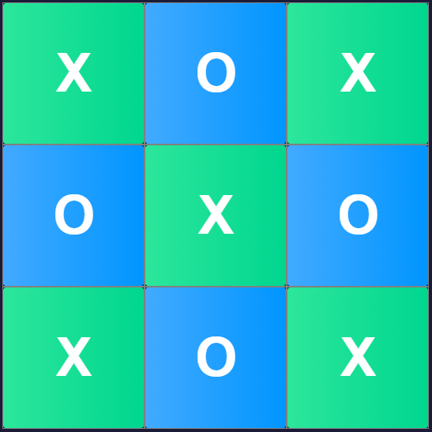
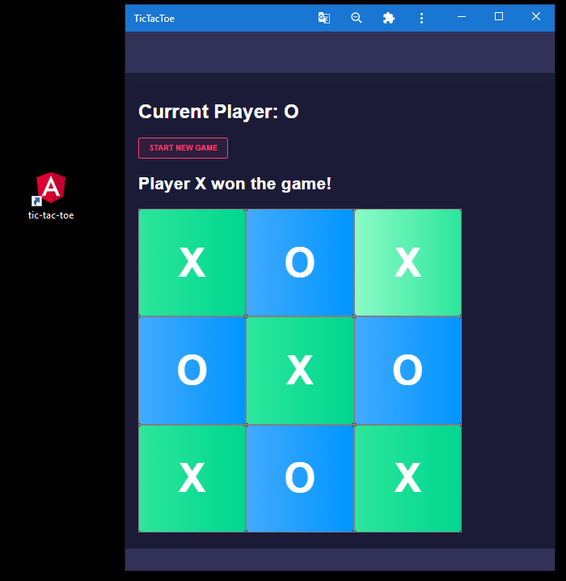

<!-- PROJECT SHIELDS -->
<!--
  São pequenas imagens informando partes importantes do projeto
  Pode ser: contribuidores, issues, linguagens, licenças, etc
-->
[](https://angular.io)
[](https://www.typescriptlang.org/)
[](https://firebase.google.com/?hl=pt-br)

<!-- PROJECT LOGO -->
<br />
<p align="center">
  <a href="https://github.com/LetsTN/TicTacToe">
    
  </a>

  <h3 align="center">Tic Tac Toe</h3>

  <p align="center">
    Famoso jogo da velha, feito em Angular
  </p>
</p>


<!-- TABLE OF CONTENTS -->
## Índice

* [Sobre o Projeto](#sobre-o-projeto)
* [Como rodar o projeto](#getting_started)
* [Uso](#uso)
* [Roadmap](#roadmap)
* [Contribua](#contribua)
* [Autores](#autores)


<!-- ABOUT THE PROJECT -->
## Sobre o Projeto


Esse joguinho foi feito em uma lição do [fireship.io](https://fireship.io) (disponível em [link](https://fireship.io/courses/angular/start-angular-beginner-tutorial/)).

É um projeto simples para entender como que funciona uma aplicação montada com Angular. Caso queira ver o resultado final, vá até [TicTacToe](https://tic-tac-toe-32bf7.web.app).

### As (principais) tecnologias usadas nesse projeto foram:
- [Angular Badge](https://angular.io)
- [Typescript](https://www.typescriptlang.org)
- [Firebase](https://firebase.google.com/?hl=pt-br)

## Como rodar o projeto? <a name = "getting_started"></a>
Essas instruções mostam como ter uma cópia do projeto instalada e funcionando em sua máquina local para fins de desenvolvimento e teste.

### Pré-requisitos
Antes de mais nada, você precisa ter instalado:

* [Node.js](https://nodejs.org/en/download/)

* npm
```sh
npm install npm@latest -g
```

* @angular/cli
```sh
npm install -g @angular/cli
```

#### Opcional
* Crie uma conta [Firebase](https://firebase.google.com/?hl=pt-br) para dar deploy do projeto lá

### Instalação
Para instalar:

1. Clone o repositório
```sh
git clone https://github.com/LetsTN/curso-Node-API.git
```

2. Instale os pacotes
```sh
npm install
```

## Uso
Rode o projeto localmente com 
```sh
ng serve
```

e vá até [http://localhost:4200](http://localhost:4200)

Caso queira dar deploy no Firebase, assista o vídeo ;) (é muito bom e rápido, vale a pena).

## Roadmap
Vá em [open issues](https://github.com/LetsTN/TicTacToe/issues) para uma lista de funcionalidades futuras (and issues).


## Contribua
As contribuições são o que torna a comunidade de código aberto um lugar incrível para aprender, inspirar e criar. Quaisquer contribuições que você fizer serão **muito apreciadas**.

Caso queira contribuir, siga esses passos:

1. Dê um fork no projeto
2. Crie uma branch com sua contribuição (`git checkout -b feature/suaFeature`)
3. Dê um commit com suas mudanças (`git commit -m 'Adicionando suaFeature'`)
4. Dê um push para sua branch (`git push origin feature/suaFeature`)
5. Abra uma pull request
